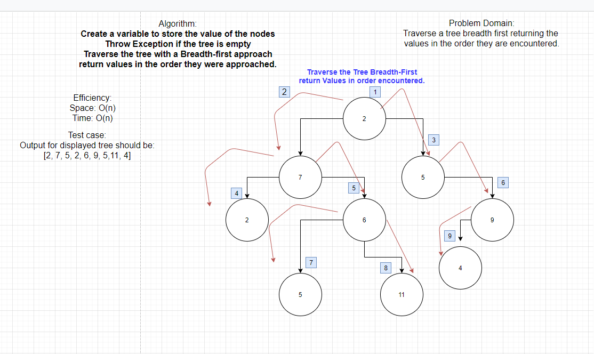

# Code Challenge 15
## Trees

### **Requirements:**

- Create a Node class that has properties for the value stored in the node, the left child node, and the right child node.
- Create a BinaryTree class
    - Define a method for each of the depth first traversals called `preOrder`, `inOrder`, and `postOrder` which returns an array of the values, ordered appropriately. 
      
- Any exceptions or errors that come from your code should be semantic, capturable errors. For example, rather than a default error thrown by your language, your code should raise/throw a custom, semantic error that describes what went wrong in calling the methods you wrote for this lab.

- Create a BinarySearchTree class
    - Define a method named `add` that accepts a value, and adds a new node   with that value in the correct location in the binary search tree.
    - Define a method named `contains` that accepts a value, and returns a boolean indicating whether or not the value is in the tree at least once.

### **Structure and Testing:**

Utilize the Single-responsibility principle: any methods you write should be clean, reusable, abstract component parts to the whole challenge. You will be given feedback and marked down if you attempt to define a large, complex algorithm in one function definition.

**Write tests to prove the following functionality:**

- Can successfully instantiate an empty tree
- Can successfully instantiate a tree with a single root node
- Can successfully add a left child and right child to a single root node
- Can successfully return a collection from a preorder traversal
- Can successfully return a collection from an inorder traversal
- Can successfully return a collection from a postorder traversal

**Ensure tests are passing before you submit your solution.**

# Code Challenge 16

## Extend Trees

### Add a feature:
- Write an instance method called find-maximum-value. Without utilizing any of the built-in methods available to your language, return the maximum value stored in the tree. You can assume that the values stored in the Binary Tree will be numeric.

# Code Challenge 17

## Extend Trees

### Add a feature:
- Write a breadth first traversal method which takes a Binary Tree as its unique input. Without utilizing any of the built-in methods available to your language, traverse the input tree using a Breadth-first approach, and return a list of the values in the tree in the order they were encountered.

# Code Challenge 26
# 26 April 2021
## Insertion Sort
### Review the pseudocode below, then trace the algorithm by stepping through the process with the provided sample array. Document your explanation by creating a blog article that shows the step-by-step output after each iteration through some sort of visual.

# Code Challenge 30
# 29 April 2021
## Hash Table Implementation
### 
- add: takes in both the key and value. This method should hash the key, and add the key and value pair to the table, handling collisions as needed.
- get: takes in the key and returns the value from the table.
- contains: takes in the key and returns a boolean, indicating if the key exists in the table already.
- hash: takes in an arbitrary key and returns an index in the collection.
  Write tests to prove the following functionality:

- Adding a key/value to your hashtable results in the value being in the data structure
- Retrieving based on a key returns the value stored
- Successfully returns null for a key that does not exist in the hashtable
- Successfully handle a collision within the hashtable
- Successfully retrieve a value from a bucket within the hashtable that has a collision
- Successfully hash a key to an in-range value

# Code Challenge 31
# 3 May 2021
## Hash Table Continued
### Feature Task
- Write a function that accepts a lengthy string parameter.
- Without utilizing any of the built-in library methods available to your language, return the first word to occur more than once in that provided string.

# Code Challenge 32
# 4 May 2021
## Find common values in 2 Binary Trees 
- Write a function called tree_intersection that takes two binary tree parameters.
- Without utilizing any of the built-in library methods available to your language, return a set of values found in both trees.

# Code Challenge 33
# 6 May 2021
## Implement a simplified LEFT JOIN for 2 Hashmaps
### 
- Write a function that LEFT JOINs two hashmaps into a single data structure.
- The first parameter is a hashmap that has word strings as keys, and a synonym of the key as values.
- The second parameter is a hashmap that has word strings as keys, and antonyms of the key as values.
- Combine the key and corresponding values (if they exist) into a new data structure according to LEFT JOIN logic.
- LEFT JOIN means all the values in the first hashmap are returned, and if values exist in the “right” hashmap, they are appended to the result row. If no values exist in the - right hashmap, then some flavor of NULL should be appended to the result row.
- The returned data structure that holds the results is up to you. It doesn’t need to exactly match the output below, so long as it achieves the LEFT JOIN logic.
- Avoid utilizing any of the library methods available to your language.

